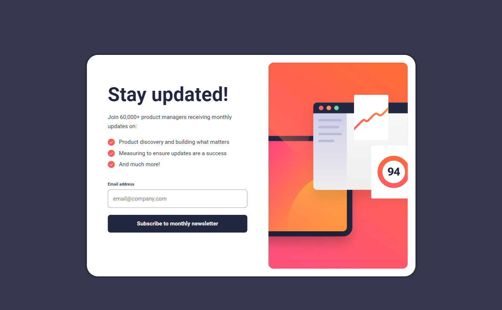
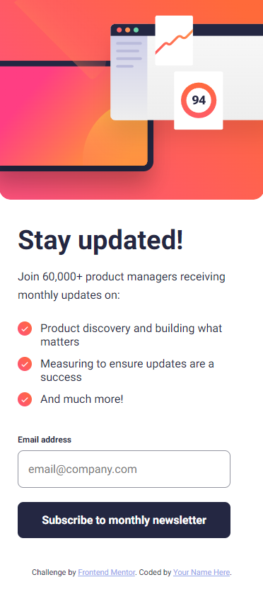

# Frontend Mentor - Newsletter sign-up form with success message solution

This is a solution to the [Newsletter sign-up form with success message challenge on Frontend Mentor](https://www.frontendmentor.io/challenges/newsletter-signup-form-with-success-message-3FC1AZbNrv). Frontend Mentor challenges help you improve your coding skills by building realistic projects.

## Table of contents

- [Overview](#overview)
  - [The challenge](#the-challenge)
  - [Screenshot](#screenshot)
  - [Links](#links)
- [My process](#my-process)
  - [Built with](#built-with)
  - [What I learned](#what-i-learned)
  - [Useful resources](#useful-resources)
- [Author](#author)

## Overview

### The challenge

Users should be able to:

- Add their email and submit the form
- See a success message with their email after successfully submitting the form
- See form validation messages if:
  - The field is left empty
  - The email address is not formatted correctly
- View the optimal layout for the interface depending on their device's screen size
- See hover and focus states for all interactive elements on the page

### Screenshot

### Links

- Solution URL: [Frontend Mentor Solution](https://your-solution-url.com)
- Live Site URL: [GitHub Pages](https://smithy773.github.io/newsletter-sign-up-with-success-message-main/)

## My process

### Built with

- Semantic HTML5 markup
- CSS custom properties
- CSS responsive design
- JavaScript Validation API
- Flexbox
- Desktop-first workflow

### What I learned

Learned how to apply custom form validation using Constraint Validation!

### Useful resources

- [w3schools](https://www.w3schools.com/js/js_validation_api.asp) - This helped me for the JavaScript Validation API.
- [MDN Web Docs](https://developer.mozilla.org/en-US/docs/Web/API/ValidityState) - Also greatly helped with JavaScript Validation API, which was the most challenging part of the exercise.

## Author

- Frontend Mentor - [@smithy773](https://www.frontendmentor.io/profile/smithy773)
- GitHub - [@smithy773](https://github.com/smithy773)
